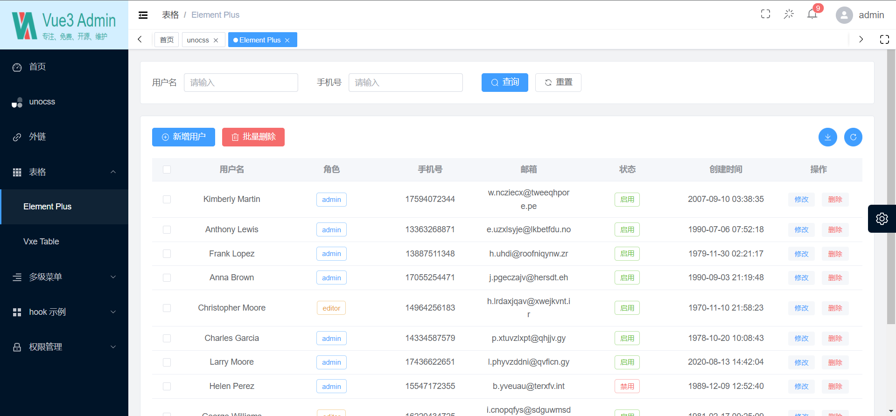
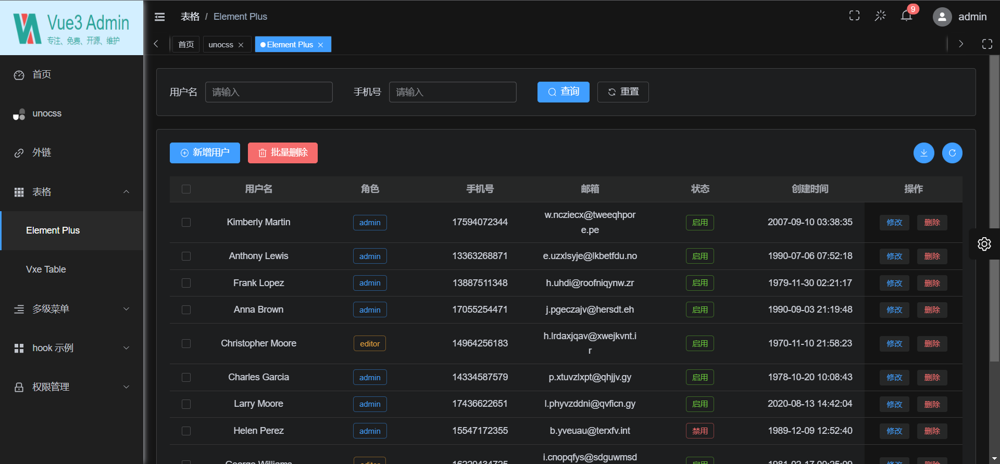
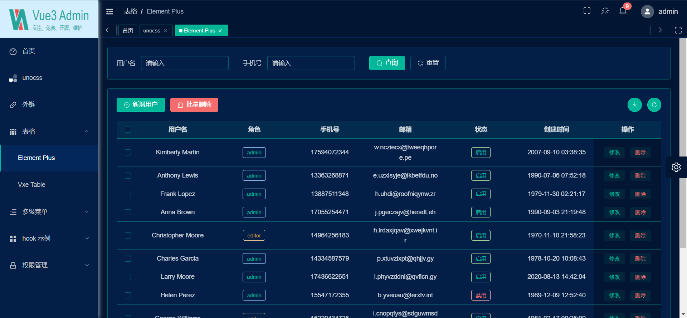
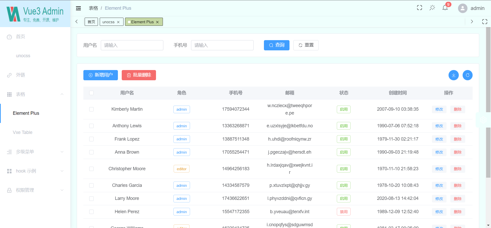

<div align="center">
  
  <h1>Vue3 Admin Vite</h1>
  <span>English | <a href="./README.zh-CN.md">中文</a></span>
</div>

## ⚡ Introduction

vue3-admin-vite is a free and open source middle and background management system basic solution, based on mainstream framework such as Vue3, TypeScript, Element Plus, Pinia and Vite.

- Electron desktop: [vue3-electron-vite](https://github.com/diorlitao/vue3-electron-vite)

## Feature

- **Vue3**：The latest Vue3 composition API using Vue3 + script setup
- **Element Plus**：Vue3 version of Element UI
- **Pinia**: An alternative to Vuex in Vue3
- **Vite**：Really fast
- **Vue Router**：router
- **TypeScript**：JavaScript With Syntax For Types
- **PNPM**：Faster, disk space saving package management tool
- **Scss**：Consistent with Element Plus
- **CSS variable**：Mainly controls the layout and color of the item
- **ESlint**：Code verification
- **Prettier**： Code formatting
- **Axios**: Promise based HTTP client (encapsulated)
- **UnoCSS**: Real-time atomized CSS engine with high performance and flexibility
- **Annotation**：Each configuration item is written with as detailed comments as possible
- **Mobile Compatible**: The layout is compatible with mobile page resolution

## Functions

- **User management**: log in, log out of the demo
- **Authority management**: Built-in page permissions (dynamic routing), instruction permissions, permission functions
- **Multiple Environments**: Development, Staging, Production
- **Multiple themes**: Normal, Dark, Dark Blue, theme modes
- **Error page**: 403, 404
- **Dashboard**: Display different Dashboard pages according to different users
- **Other functions**：SVG, Dynamic Sidebar, Dynamic Breadcrumb Navigation, Tabbed Navigation, Screenfull, Adaptive Shrink Sidebar

## 📚 Document

[Chinese documentation](https://github.com/diorlitao/vue3-admin-vite)

## Gitee repository

[Gitee](https://gitee.com/diorlitao/vue3-admin-vite)

## Online preview

| Location     | account             | Link                                                |
| ------------ | ------------------- | --------------------------------------------------- |
| github-pages | `admin` or `editor` | [Link](https://diorlitao.github.io/vue3-admin-vite) |

## 🚀 Development

```bash
# configure
1. installation of the recommended plugins in the .vscode directory
3. node version 16+
4. pnpm version 7.x

# clone
git clone https://github.com/diorlitao/vue3-admin-vite.git

# enter the project directory
cd vue3-admin-vite

# install dependencies
pnpm i

# start the service
pnpm dev
```

## ✔️ Preview

```bash
# stage environment
pnpm preview:stage

# prod environment
pnpm preview:prod
```

## 📦️ Multi-environment packaging

```bash
# build the stage environment
pnpm build:stage

# build the prod environment
pnpm build:prod
```

## 🔧 Code inspection

```bash
# code formatting
pnpm lint

# unit test
pnpm test
```

## Git commit specification reference

- `feat` add new functions
- `fix` Fix issues/bugs
- `perf` Optimize performance
- `style` Change the code style without affecting the running result
- `refactor` Re-factor code
- `revert` Undo changes
- `test` Test related, does not involve changes to business code
- `docs` Documentation and Annotation
- `chore` Updating dependencies/modifying scaffolding configuration, etc.
- `workflow` Work flow Improvements
- `ci` CICD
- `types` Type definition
- `wip` In development

## Project preview






## 💕 Thanks star

Small projects are not easy to get a star, if you like this project, welcome to support a star! This is the only motivation for the author to maintain it on an ongoing basis (whisper: it's free after all)

## 📄 License

[MIT](./LICENSE)

Copyright (c) 2022 [diorlitao](https://github.com/diorlitao)
